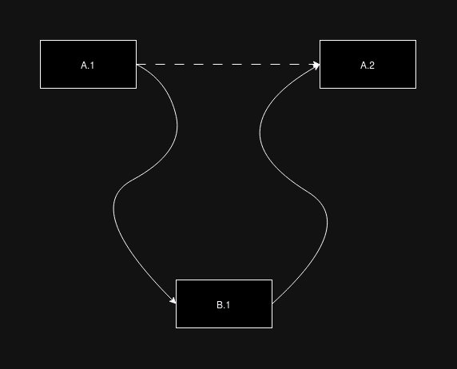

# Assumptions

Document regarding assumptions of the data in the repository.

Data assumptions are that:

* The year will always have 4 characters and there are a maximum of 99 hours in the day. (Won't support the year 10000000000000 with its' 105 hours a day).
* Time zones are ignored (NaiveDateTime)

Considering this input content:

```bash
BASED: SVQ

RESERVATION
SEGMENT: Flight SVQ 2023-03-02 06:40 -> BCN 09:10

RESERVATION
SEGMENT: Hotel BCN 2023-01-05 -> 2023-01-10

RESERVATION
SEGMENT: Flight SVQ 2023-01-05 20:40 -> BCN 22:10
SEGMENT: Flight BCN 2023-01-10 10:30 -> SVQ 11:50

RESERVATION
SEGMENT: Train SVQ 2023-02-15 09:30 -> MAD 11:00
SEGMENT: Train MAD 2023-02-17 17:00 -> SVQ 19:30

RESERVATION
SEGMENT: Hotel MAD 2023-02-15 -> 2023-02-17

RESERVATION
SEGMENT: Flight BCN 2023-03-02 15:00 -> NYC 22:45
SEGMENT: Flight NYC 2023-03-06 08:00 -> BOS 09:25
```

The file is split into reservations and segments. The reservations are effectively a group of date-ordered segments and they always need to have those defined segments in them, even if they aren't direct connections.

Likewise, the segments don't need to have the exact relationship as they have initially and can be combined with other reservations. Essentially one segment from reservation B *could* be inserted in between two currenctly existing segments from reservation A.

Example:

```
# Reservation B
RESERVATION
SEGMENT: Hotel BCN 2023-01-05 -> 2023-01-10

# Reservation A
RESERVATION
SEGMENT: Flight SVQ 2023-01-05 20:40 -> BCN 22:10
SEGMENT: Flight BCN 2023-01-10 10:30 -> SVQ 11:50
```

This, according to the output:

```
TRIP to BCN
Flight from SVQ to BCN at 2023-01-05 20:40 to 22:10
Hotel at BCN on 2023-01-05 to 2023-01-10
Flight from BCN to SVQ at 2023-01-10 10:30 to 11:50
```

Is an implication that the list should go with the following order of elements: `A.1 -> B.1 -> A.2`.

A graphical representation would be:



> You may consider two flights to be a connection if there is less than 24 hours difference.

In the code, it is also assumed that `Trains` have this behaviour. In the example given there aren't any connected trains, but if there were, it would behave the same.

The segments which start the trips are those which have the starting location set as `SVQ`.

> TRIP to NYC, BOS

The cities shown in this `TRIP` line are those in the whole travel which aren't the starting city `SVQ`. If the trip were `SVQ` -> `NYC` -> `BOS` -> `BEG` -> `LHR` -> `SVQ`, the `TRIP` line would be: `TRIP to NYC, BOS, BEG, LHR`.